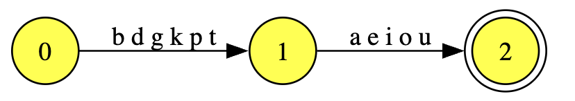
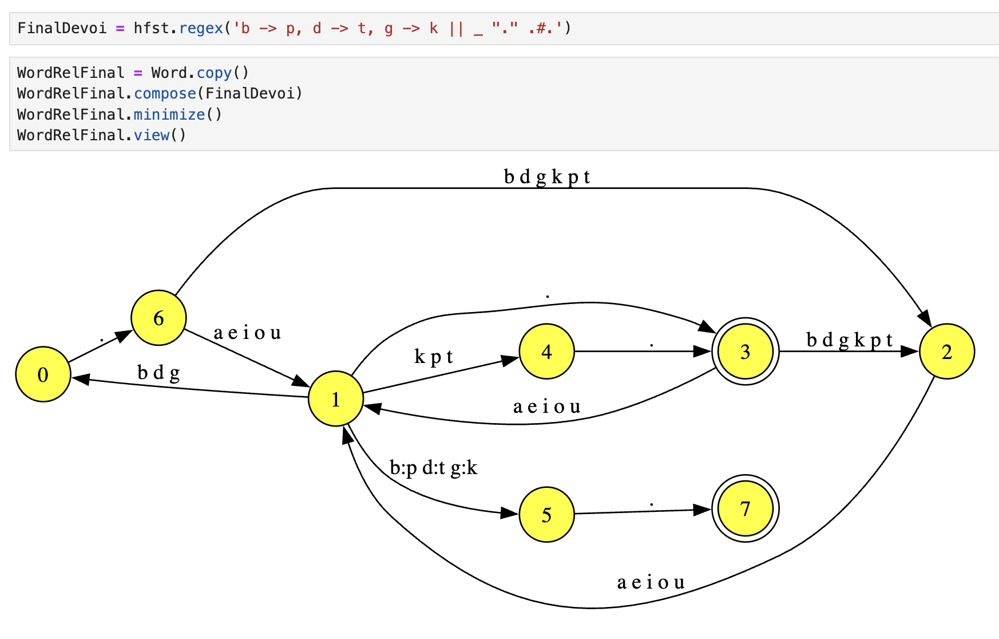

# HfstTransducer.view
Restore a version of the method for viewing a transducer in a Jupyter notebook.  This is found in the `hfst_dev` branch, but not in a current `hfst 3.16.0.1`.

# Setup
```
import hfst
import hfst_transducer_view

hfst_transducer_view.install()
```

# Functionality

```
Vow = hfst.regex("[a|e|i|o|u]")
Cons = hfst.regex("[p|b|t|d|k|g]")
CV = Cons.copy()
CV.concatenate(Vow)
CV.view()
```



This is part of a more complicated example. Word consists of (C)V(C) syllables with a dot separator. FinalDevoi is final devoicing.  In the transducer, underlying b, d, and g are realized as surface p, t and k.




# Notebook
For more, see demo_view.ipynb.


